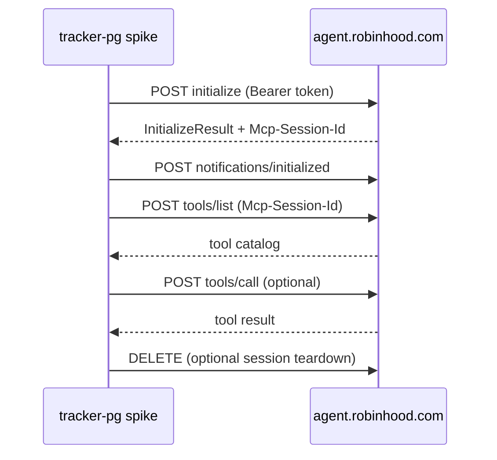

# Phase 0: Robinhood Agentic Trading (MCP) Discovery

Status: **in progress** — unauthenticated probes complete; authenticated tool inventory pending your OAuth run.

## Goal

Validate Robinhood's MCP integration before building Phase 1 (read-only sync sidecar). Deliverables:

1. OAuth / transport documentation (this file + `findings/discovery.json`)
2. MCP tool catalog (`findings/tool-inventory.json` — requires auth)
3. Read vs write boundary confirmation
4. Decision: proceed to Phase 1 sidecar

---

## What we confirmed (no auth required)

Probed on 2026-06-12 via `robinhood-agent-svc/phase0_discover.py`.

### MCP endpoint

| Item | Value |
|------|-------|
| URL | `https://agent.robinhood.com/mcp/trading` |
| Transport | Streamable HTTP (POST + optional SSE) |
| Session header | `Mcp-Session-Id` (returned on initialize) |
| Auth | Bearer token in `Authorization` header |
| Unauthenticated | HTTP 401, `www-authenticate: Bearer resource_metadata="…"` |
| CORS | `access-control-allow-origin: *` |
| Methods | GET, POST, OPTIONS, DELETE |

### OAuth (RFC 8414 + dynamic registration)

| Item | Value |
|------|-------|
| Authorization server metadata | `https://agent.robinhood.com/.well-known/oauth-authorization-server` |
| Protected resource metadata | `https://agent.robinhood.com/.well-known/oauth-protected-resource/mcp/trading` |
| Authorization endpoint | `https://robinhood.com/oauth` |
| Token endpoint | `https://api.robinhood.com/oauth2/token/` |
| Registration endpoint | `https://agent.robinhood.com/oauth/trading/register` |
| Scope | `internal` |
| Grants | `authorization_code`, `refresh_token` |
| PKCE | S256 required |
| Client auth | `none` (public client + PKCE) |
| Dynamic registration | **Works** — POST with `redirect_uris`, receive `client_id` |

### MCP lifecycle (from spec + Robinhood headers)



---

## Robinhood product constraints (from official docs)

- **Agentic account** is a separate, user-funded brokerage account — trades only land there
- **Read access** spans all Robinhood accounts (positions, balances, order history)
- **Write access** (orders) only in the Agentic account
- **Desktop-only** onboarding when first connecting MCP
- **Equities beta** — options, crypto, futures not supported yet
- User responsible for agent trades; Robinhood does not audit third-party agents

Sources: [Agentic Trading overview](https://robinhood.com/us/en/support/articles/agentic-trading-overview/)

---

## Phase 0 checklist

### A. Cursor MCP (exploratory, ~10 min)

- [ ] Settings → Cursor Settings → Tools & MCPs → Connect
- [ ] Paste `https://agent.robinhood.com/mcp/trading`
- [ ] Authenticate in browser (desktop)
- [ ] Complete Agentic account onboarding + fund with test budget
- [ ] Ask read-only questions: portfolio value, positions, recent orders
- [ ] **Do not** place trades until guardrails are defined
- [ ] Note which tools Cursor exposes in the MCP panel

### B. Spike scripts (structured inventory)

```bash
cd robinhood-agent-svc
python3 -m venv .venv && source .venv/bin/activate
pip install -r requirements.txt

python phase0_discover.py --write findings/discovery.json   # done
python phase0_oauth.py                                       # opens browser → .tokens.json
python phase0_inventory.py                                   # → findings/tool-inventory.json
python phase0_inventory.py --probe-read-tools                # optional read-only probes
```

- [ ] `phase0_oauth.py` completed
- [ ] `findings/tool-inventory.json` generated
- [ ] Read-only tool probes documented below
- [ ] One write tool identified but **not called** until Phase 2

### C. Read vs write boundary

| Test | Expected | Actual | Pass? |
|------|----------|--------|-------|
| MCP initialize with Bearer | 200 + session | _pending auth_ | |
| tools/list | Non-empty catalog | _pending_ | |
| Read tool (portfolio/positions) | Data from all accounts | _pending_ | |
| Order tool schema | Requires symbol/qty/side | _pending_ | |
| Order in primary account | Should fail or be unavailable | _pending_ | |
| Order in Agentic account | Succeeds (manual test only) | _pending_ | |

Fill this table after running `phase0_inventory.py`.

---

## Tool inventory (fill after auth)

_Paste or link `findings/tool-inventory.json` summary here once generated._

| Tool name | Description | Read/Write | Notes |
|-----------|-------------|------------|-------|
| _TBD_ | | | |

---

## Open questions for Phase 1

| # | Question | How to answer |
|---|----------|---------------|
| 1 | Exact tool names and input schemas | `phase0_inventory.py` |
| 2 | Access token TTL + refresh behavior | `phase0_oauth.py --refresh` after ~1h |
| 3 | Rate limits on sync | Repeated `tools/list` / read calls |
| 4 | Account ID in responses — Agentic vs primary | Compare portfolio tool output to RH app |
| 5 | Server-side token storage model | Design in Phase 1 (encrypt like Plaid) |

---

## Implications for tracker-pg

| Current | Phase 0 finding | Phase 1 direction |
|---------|-----------------|-------------------|
| CSV import only | MCP provides live read/write | Sidecar `robinhood-agent-svc` |
| No OAuth | PKCE + dynamic registration works | Per-user token store in Postgres |
| Holdings computed from CSV | MCP can read live positions | New `robinhood_agentic_*` tables |
| Predicts = signals only | MCP can execute | Phase 2 bridge with guardrails |
| Plaid pattern exists | Similar connect → sync flow | Reuse encrypted token pattern |

---

## Exit criteria (Phase 0 → Phase 1)

- [x] Unauthenticated OAuth/MCP metadata documented
- [x] Spike scripts runnable locally
- [ ] Authenticated tool catalog captured
- [ ] Read vs write boundary confirmed
- [ ] Team decision: fund Agentic sandbox account for dev

When the last three items are checked, start Phase 1 (read-only sync sidecar + Flyway schema).
