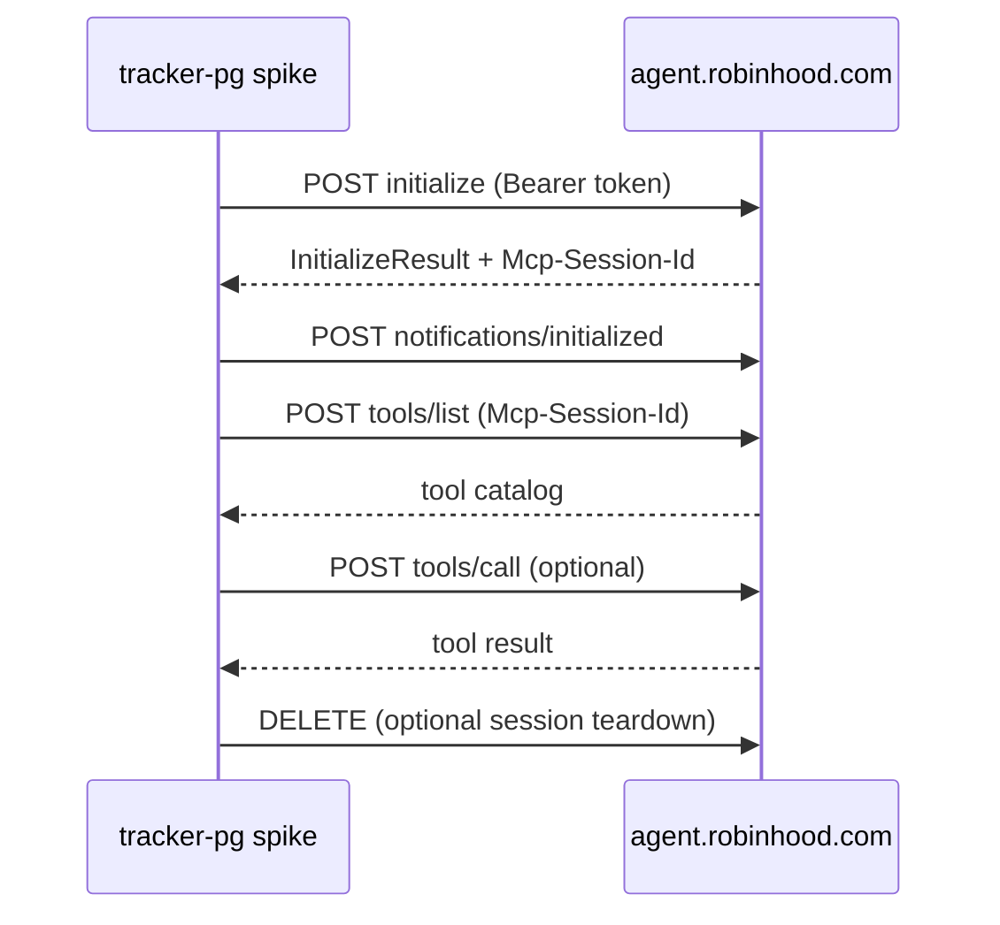

# Phase 0: Robinhood Agentic Trading (MCP) Discovery

Status: **mostly complete** — OAuth, 23-tool catalog, and account schema confirmed on Lightsail.

## Goal

Validate Robinhood's MCP integration before building Phase 1 (read-only sync sidecar). Deliverables:

1. OAuth / transport documentation (this file + `findings/discovery.json`)
2. MCP tool catalog (`findings/tool-inventory.json` — requires auth)
3. Read vs write boundary confirmation
4. Decision: proceed to Phase 1 sidecar

---

## What we confirmed (no auth required)

Probed on 2026-06-12 via `robinhood-agent-svc/phase0_discover.py`.

### MCP endpoint

| Item | Value |
|------|-------|
| URL | `https://agent.robinhood.com/mcp/trading` |
| Transport | Streamable HTTP (POST + optional SSE) |
| Session header | `Mcp-Session-Id` (returned on initialize) |
| Auth | Bearer token in `Authorization` header |
| Unauthenticated | HTTP 401, `www-authenticate: Bearer resource_metadata="…"` |
| CORS | `access-control-allow-origin: *` |
| Methods | GET, POST, OPTIONS, DELETE |

### OAuth (RFC 8414 + dynamic registration)

| Item | Value |
|------|-------|
| Authorization server metadata | `https://agent.robinhood.com/.well-known/oauth-authorization-server` |
| Protected resource metadata | `https://agent.robinhood.com/.well-known/oauth-protected-resource/mcp/trading` |
| Authorization endpoint | `https://robinhood.com/oauth` |
| Token endpoint | `https://api.robinhood.com/oauth2/token/` |
| Registration endpoint | `https://agent.robinhood.com/oauth/trading/register` |
| Scope | `internal` |
| Grants | `authorization_code`, `refresh_token` |
| PKCE | S256 required |
| Client auth | `none` (public client + PKCE) |
| Dynamic registration | **Works** — POST with `redirect_uris`, receive `client_id` |

### MCP lifecycle (from spec + Robinhood headers)



---

## Robinhood product constraints (from official docs)

- **Agentic account** is a separate, user-funded brokerage account — trades only land there
- **Read access** spans all Robinhood accounts (positions, balances, order history)
- **Write access** (orders) only in the Agentic account
- **Desktop-only** onboarding when first connecting MCP
- **Equities beta** — options, crypto, futures not supported yet
- User responsible for agent trades; Robinhood does not audit third-party agents

Sources: [Agentic Trading overview](https://robinhood.com/us/en/support/articles/agentic-trading-overview/)

---

## Phase 0 checklist

### A. Cursor MCP (exploratory, ~10 min)

- [ ] Settings → Cursor Settings → Tools & MCPs → Connect
- [ ] Paste `https://agent.robinhood.com/mcp/trading`
- [ ] Authenticate in browser (desktop)
- [ ] Complete Agentic account onboarding + fund with test budget
- [ ] Ask read-only questions: portfolio value, positions, recent orders
- [ ] **Do not** place trades until guardrails are defined
- [ ] Note which tools Cursor exposes in the MCP panel

### B. Spike scripts (structured inventory)

```bash
cd robinhood-agent-svc
python3 -m venv .venv && source .venv/bin/activate
pip install -r requirements.txt

python phase0_discover.py --write findings/discovery.json   # done
python phase0_oauth.py                                       # opens browser → .tokens.json
python phase0_inventory.py                                   # → findings/tool-inventory.json
python phase0_inventory.py --probe-read-tools                # optional empty-arg probes
python phase0_inventory.py --probe-chain                     # get_accounts → portfolio/positions/orders
```

- [x] `phase0_oauth.py` completed (manual mode on Lightsail)
- [x] `findings/tool-inventory.json` generated (23 tools)
- [x] Read-only empty-arg probes (`get_accounts`, watchlists)
- [ ] `--probe-chain` for portfolio/positions/orders per account
- [x] Write tools identified (`place_equity_order`, `cancel_equity_order`) — **not called**

### C. Read vs write boundary

| Test | Expected | Actual | Pass? |
|------|----------|--------|-------|
| MCP initialize with Bearer | 200 + session | `robinhood-trading` 1.0.0 | ✓ |
| tools/list | Non-empty catalog | 23 tools | ✓ |
| get_accounts | All brokerage accounts | Returns list with `agentic_allowed` flag | ✓ |
| Agentic account marker | `agentic_allowed: true` | Present on nickname `"Agentic"` account | ✓ |
| Read tools need account_number | `get_portfolio`, positions, orders | Fail without args; need `--probe-chain` | ✓ |
| Order tool schema | Requires account_number, symbol, side, type | Confirmed via empty-arg probe | ✓ |
| Order in primary account | Should fail or be blocked | Not tested (skip until Phase 2) | — |
| Order in Agentic account | Succeeds (manual test only) | Not tested (skip until Phase 2) | — |

### Account schema (`get_accounts`)

Each account object includes:

| Field | Use |
|-------|-----|
| `account_number` | Pass to equity/portfolio/order tools |
| `rhs_account_number` | Crypto flows only |
| `brokerage_account_type` | `individual`, `ira_roth`, etc. |
| `nickname` | User label (e.g. `"Agentic"`) |
| `is_default` | Primary account |
| `agentic_allowed` | **`true` = only account MCP may trade on** |
| `management_type` | `self_directed` or `managed` |
| `option_level` | Empty on Agentic account (equities beta) |

Phase 1 sync should filter **`agentic_allowed: true`** for write path; read sync may pull all accounts or default + agentic.

---

## Tool inventory (23 tools)

| Tool name | Read/Write | Notes |
|-----------|------------|-------|
| `get_accounts` | Read | Entry point; no args |
| `get_portfolio` | Read | Requires `account_number` |
| `get_equity_positions` | Read | Requires `account_number` |
| `get_equity_orders` | Read | Requires `account_number`; optional `limit` |
| `get_equity_quotes` | Read | Requires `symbols` |
| `get_equity_historicals` | Read | Requires `symbols`, `start_time` |
| `get_equity_tradability` | Read | Requires `account_number`, `symbols` |
| `get_watchlists` | Read | No args |
| `get_watchlist_items` | Read | Requires `list_id` |
| `get_popular_watchlists` | Read | No args |
| `get_option_watchlist` | Read | No args |
| `search` | Read | Natural-language instrument lookup |
| `review_equity_order` | Read (sim) | Dry-run order; no execution |
| `place_equity_order` | **Write** | Real money; Agentic account only |
| `cancel_equity_order` | **Write** | Requires `account_number`, `order_id` |
| `create_watchlist` | Write | |
| `add_to_watchlist` | Write | |
| `remove_from_watchlist` | Write | |
| `follow_watchlist` | Write | |
| `unfollow_watchlist` | Write | |
| `update_watchlist` | Write | |
| `add_option_to_watchlist` | Write | |
| `remove_option_from_watchlist` | Write | |

MCP response shape: business data in `structuredContent` and/or JSON string in `content[].text` — use `mcp_tool_utils.parse_tool_payload()`.

---

## Open questions for Phase 1

| # | Question | How to answer |
|---|----------|---------------|
| 1 | Exact tool names and input schemas | `phase0_inventory.py` |
| 2 | Access token TTL + refresh behavior | `phase0_oauth.py --refresh` after ~1h |
| 3 | Rate limits on sync | Repeated `tools/list` / read calls |
| 4 | Account ID in responses — Agentic vs primary | **`agentic_allowed: true`** on Agentic account | ✓ |
| 5 | Server-side token storage model | Design in Phase 1 (encrypt like Plaid) |

---

## Implications for tracker-pg

| Current | Phase 0 finding | Phase 1 direction |
|---------|-----------------|-------------------|
| CSV import only | MCP provides live read/write | Sidecar `robinhood-agent-svc` |
| No OAuth | PKCE + dynamic registration works | Per-user token store in Postgres |
| Holdings computed from CSV | MCP can read live positions | New `robinhood_agentic_*` tables |
| Predicts = signals only | MCP can execute | Phase 2 bridge with guardrails |
| Plaid pattern exists | Similar connect → sync flow | Reuse encrypted token pattern |

---

## Exit criteria (Phase 0 → Phase 1)

- [x] Unauthenticated OAuth/MCP metadata documented
- [x] Spike scripts runnable locally
- [x] Authenticated tool catalog captured (23 tools)
- [x] Read vs write boundary confirmed (`agentic_allowed` flag)
- [x] Agentic sandbox account exists (nickname `"Agentic"`)
- [ ] `--probe-chain` portfolio/positions/orders verified

When `--probe-chain` passes, start Phase 1 (read-only sync sidecar + Flyway schema).
